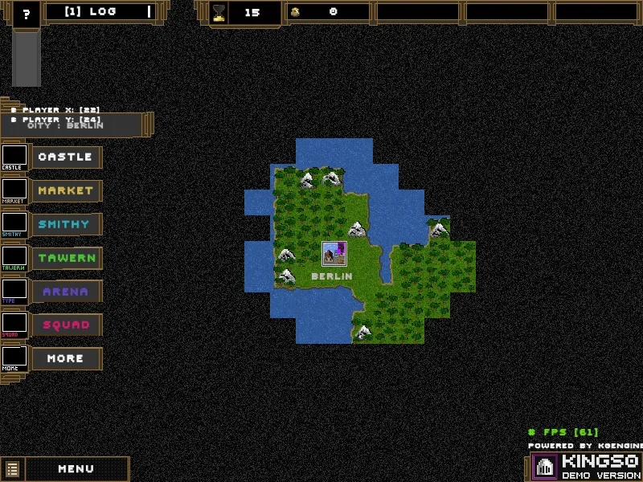

<h1>Kingso C++</h1>

## So, what is this?

Kings0 or the subsequent [Kingso](https://store.steampowered.com/app/1385180/Kingso/) is a 2D fantasy medieval game whose development began with the study of C++ and graphics technologies. In 2019, it was just a technological demonstration of graphics and mechanics. The latest build has version 230331 and includes sandbox gameplay, more optimized graphics, several game maps, artificial intelligence, and game mechanics.

## What are the problems with this implementation?

The problems lie in the fact that the game engine called K0 merges with the genre of the game itself and does not allow for the creation of games from other genres, making the engine inflexible to changes. Even after the engine itself was divided into modules, they still don’t solve the entire problem of functionality. Additionally, there is no support for user modifications and scripting languages, meaning that the engine and its modules were constantly rebuilt during development. It should also be noted that the current implementation uses SFML, which is a poor approach, but surprisingly it works so well.

## Is there a continuation?

To track the further development path, attention should be paid to the [Lacuna Engine](https://github.com/miruji/Lacuna-Engine), a 2D game engine written in C++ that incorporates all the accumulated experience, solving many problems of the current implementation. Lacuna has its own editors for quick work, script support through luajit, very good graphics optimization, and project management. Some parts of the Kingso game were ported to Lacuna Engine.

> Development of Lacuna Engine was archived due to the presence of a copy in the form of Godot Engine, with a stronger audience and already more developed mechanisms for game development. Therefore, the latest versions of the game were created entirely on Godot, which solves all the tasks of the game very well.

## Usage of materials

When using the current implementation, follow the license. To run the working version, you need to download it from the releases and own the game purchased on Steam, or you can remove the block yourself in main.

## Screenshots

### Version 210630

### Version 230318

